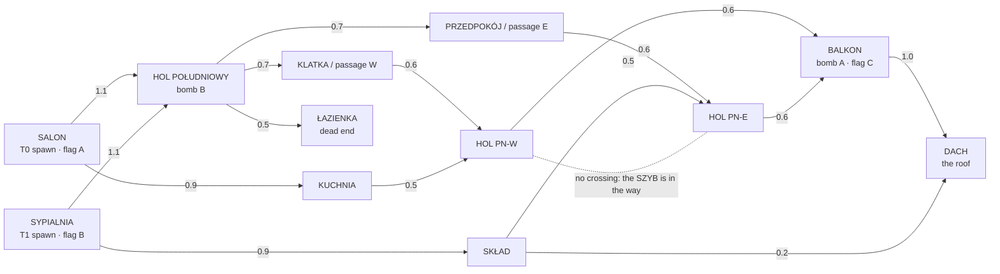

# MAP_2 — GÓRA, the flat above the shop (Drop G)

**Status: signed off by the owner 2026-09-08 (the sign-off sheet at the end, and "już") and BUILT.**
The draft below is the intent; `packages/shared/src/gora.ts` is the same layout in solids, and the
generic map suite (`map.test.ts`, `mapFlags.test.ts`, `floorAudit.test.ts`, all of which loop
`Object.values(MAPS)`) judges it. **See "As built" at the end** for every place the geometry left
the drawing and why — including the two things the drawing got wrong and the real geometry caught.

`PLAN_2_1.md` Drop G says: *"Layout drafted as a top-down diagram in `docs/MAP_2.md` and approved
before geometry."* This is that draft, in the shape `docs/WEAPON_MATRIX.md` took for Drop B: the
whole map decided on paper, in the vocabulary the pipeline already has, with the numbers measured
rather than guessed, and a sign-off line at the bottom. Nothing in `packages/shared/src/map.ts`
moves until that line is filled in.

Every distance and time below was produced by `apps/client/e2e/tools/map-rotation.ts`, which runs
the real shared simulation (`simulateBody` — the same code the server ticks and the client
predicts with). The plan diagram is rendered from the extents table by
`apps/client/e2e/tools/map-plan.ts`, so the picture and the numbers cannot drift apart. Both write
to `apps/client/e2e/out/g/` (gitignored, like every other tool output in this repo); regenerate
with the command in each tool's header:

```
./apps/server/node_modules/.bin/tsx apps/client/e2e/tools/map-rotation.ts > apps/client/e2e/out/g/rotation.md
./apps/server/node_modules/.bin/tsx apps/client/e2e/tools/map-plan.ts     > apps/client/e2e/out/g/plan.txt
```

---

## 1. The theme, and why it plays differently

**GÓRA is the barber's own flat, one floor above the shop: two rooms at each end, a hall wrapped
around a boarded-up stair core, a light well open to the sky, and a back balcony with a fire escape
up to the roof.** The plan offered a choice between the back alley / delivery yard and the upstairs
flat, and the flat is the one worth building, because NIGHT_DISTRICT *already contains* an alley and
a loading yard (`map.ts:113-116`) — a second yard would be a re-skin, a different set of textures on
the same fight. The difference has to be structural, and the measurement says where it is. Sampling
400 000 eye-to-eye pairs across NIGHT_DISTRICT's 24 751 walkable cells, its **median clear sight
line is 24.0 m**, 36.6 % of its clear lines are over 30 m, and its longest is 111 m. It is a map of
lanes, and the long guns own every one of them. GÓRA's longest line is **20 m** (the balcony), its
longest interior line is **16 m** (the south hall, through two doorframes), and everything else is
5–12 m: a room, a doorway, a corner. That inverts the roster Drop B just finished tuning — the S12,
the K-7 and the clippers become the sensible picks and the SR-50 gets exactly two places to matter,
both of which can be walked in on from behind. It compresses time as well as distance: first contact
is **3.6 s** off spawn instead of 8.0 s, and a bomb rotation is **2.3 s** instead of 10.9 s, so a
round is a series of decisions taken at a doorway rather than a jog followed by a duel. And it is
the right *fiction*: the vision paragraph says the barber shop is a mechanic, not a backdrop, and
this is the shop's own upstairs — the stock in the boxes, the mirrors against the wall, the chair
nobody threw out. Ostrzyżeni is the mode that gains most: a chaser with clippers in a loop of rooms
with a dead-end bathroom is the joke working as designed, where 62 m of open street is where that
chaser gets shot (`PLAN_2_1.md`, Decisions 2026-09-08).

---

## 2. The map at a glance

| | NIGHT_DISTRICT | GÓRA |
|---|---|---|
| id / name | `night_district` · Night District | `gora` · GÓRA (THE FLAT) |
| Footprint | 62 × 68 m outdoor block | **34 × 18 m**, one floor + a roof |
| Walkable grid | 24 751 cells (5 110 m² reachable) | **2 253 cells** (254 m² reachable) |
| Levels | street, mezzanine, gantry, container stack | floor (y 0) and roof (y 3.0) |
| Ceiling | 3.6 m shop / 6.0 m industrial / open sky | **2.8 m** indoors |
| Players | up to 12 | **2–6** |
| Median clear sight line | **24.0 m** | **5.0 m** (both measured on the built geometry) |
| Longest sight line | **111 m** | **31.5 m** (drafted 20; see "As built") |
| Spawn → spawn | 8.0 s | **5.0 s** |
| Bomb A ↔ B rotation | 10.9 s | **2.2 s** |

---

## 3. The plan

```
LEVEL 0 — the flat (floor y = 0, ceiling 2.8)   N ↑ (+Z)   E → (+X)   # wall/solid   : open shaft   / stair
         x=-15     x=-10      x=-5      x=0      x=5     x=10     x=15
z= 11  |                ################################################        |
z= 10  |               #                 BALKON                 /SCHODY/#       |
z=  9  |  ##############                                        ////////######  |
z=  8  | #                  ####    ################    ####                  # |
z=  7  | #                             ::::::::::                             # |
z=  6  | #      KUCHNIA       HOL PN-W :::SZYB:::  HOL PN-E        SKLAD      # |
z=  5  | #                             ::::::::::                             # |
z=  4  | #                             ##########                             # |
z=  3  | #                   KLATKA    ###RDZEN##    PRZEDP.                  # |
z=  2  |  ##################           ##########           ##################  |
z=  1  |  ##################           ##########           ##################  |
z=  0  | #                              HOL POL.                              # |
z= -1  | #                                                                    # |
z= -2  | #                  ###########          ###########                  # |
z= -3  | #       SALON      #         #          #         #     SYPIALNIA    # |
z= -4  | #                  #         # LAZIENKA #         #                  # |
z= -5  | #                  #         #          #         #                  # |
z= -6  | #                  #         #          #         #                  # |
z= -7  | #                  #          ##########          #                  # |
z= -8  |  ##################                                ##################  |

LEVEL +1 — DACH, the roof over the east wing (deck y = 3.0, parapet 1.2). / = the fire escape up from the balcony and the loft-stair opening down into the SKŁAD.
         x=-15     x=-10      x=-5      x=0      x=5     x=10     x=15
z= 11  |                                                        ##########      |
z= 10  |                                                       #//SCHODY//#     |
z=  9  |                                                ########////////// ###  |
z=  8  |                                               #                      # |
z=  7  |                                               #               ////   # |
z=  6  |                                               #              STRYCH  # |
z=  5  |                                               #               ////   # |
z=  4  |                                               #               ////   # |
z=  3  |                                               #  DACH  y=3.0  ////   # |
z=  2  |                                               #                      # |
z=  1  |                                               #                      # |
z=  0  |                                               #                      # |
z= -1  |                                               #                      # |
z= -2  |                                               #                      # |
z= -3  |                                                ######################  |
z= -4  |                                                                        |
z= -5  |                                                                        |
z= -6  |                                                                        |
z= -7  |                                                                        |
z= -8  |                                                                        |
```

Two rings around a solid middle. The **inner ring** is the south hall → a 2 m passage beside the
core → a north hall leg → back; the **outer ring** is kitchen or stock room → a north hall leg →
one of the two balcony doors → the balcony → the other door. The middle is not a room: it is the
boarded stair core (RDZEŃ) with the light well (SZYB) directly north of it, so the map has a hole
in it and everything that matters happens on the loop around that hole. The only vertical is the
roof over the east wing, and it is reached from outside the flat.

### Areas and extents (metres, +X east, +Z north, floor y = 0)

| # | Area | x | z | m² | What it is, and the fight it is for |
|---|---|---|---|---|---|
| 1 | **SALON** | −17 … −8 | −7 … 1 | 72 | Living room over the street. Team 0 home, dom flag **A**, buy station. Sofa/table/sideboard cover; three windows (glass, breakable-looking, not breakable). |
| 2 | **KUCHNIA** | −17 … −8 | 3 … 9 | 54 | Kitchen. Island unit = the one hard cover in the west. Door east into HOL PN-W, door south into SALON. |
| 3 | **SYPIALNIA** | 8 … 17 | −7 … 1 | 72 | Bedroom. Team 1 home, dom flag **B**, buy station. Mirror of the salon in shape, not in dressing. |
| 4 | **SKŁAD** | 8 … 17 | 3 … 9 | 54 | The barber's stock: boxes, spare chairs, shelving. Mirror of the kitchen. Holds the shelf-and-hatch shortcut to the roof. |
| 5 | **HOL POŁUDNIOWY** | −8 … 8 | −1 … 1 | 32 | The south hall, 2 m wide and 16 m long, salon door to bedroom door. Bomb site **B** at its centre. The map's one interior long line — a shot through two doorframes, and it can be walked in on from four directions. |
| 6 | **KLATKA / PRZEDPOKÓJ** | −8 … −4.5 / 4.5 … 8 | 1 … 5 | 14 each | Vestibules, one per side, joining the two halls and the end rooms. Buy station in the KLATKA. |
| 7 | passages | −4.5 … −2.5 / 2.5 … 4.5 | 1 … 5 | 8 each | The two 2 m slots beside the core. Blind on both ends; this is where the map's fights actually start. |
| 8 | **RDZEŃ** (solid) | −2.5 … 2.5 | 1 … 5 | — | The boarded stair down to the shop. Not enterable — it is the thing everything goes around. |
| 9 | **SZYB** (void) | −2.5 … 2.5 | 5 … 8 | 15 | The light well: open to the sky, open 8 m down to the yard. Falling in kills (`killY −8`). 5 m across — a sprint jump carries **4.43 m**, so it cannot be jumped, measured, not assumed. |
| 10 | **HOL PÓŁNOCNY W / E** | −8 … −2.5 / 2.5 … 8 | 5 … 8 | 16.5 each | Two chambers flanking the well. They do **not** connect to each other: the north crossing costs a trip through the balcony or back around the core. |
| 11 | north partition | −8 … 8 | 8 … 9 | — | The flat's back wall, with two 2 m doors at x −6…−4 and x 4…6. |
| 12 | **BALKON** | −10 … 10 | 9 … 11 | 40 | The back gallery, 2 m deep, 20 m long, 1.1 m railing. Dom flag **C** and bomb site **A**. The one long line, outdoors, overlooked by the roof. |
| 13 | **SCHODY POŻAROWE** | 10 … 14 | 9 … 11 | 8 | The fire escape: nine 0.333 m steps climbing east from the balcony's end to the roof's north-east corner. |
| 14 | **ŁAZIENKA** | −2.5 … 2.5 | −6 … −1 | 25 | Tiled, one door onto the south hall, no second way out. The map's only dead end, on purpose. |
| 15 | **DACH** | 6 … 17 | −2 … 8 | 110 | Roof over the east wing, deck 3.0, parapet 1.1. Two ways up, both slow and both audible. Sees the balcony, the well and the sky; nothing indoors. |

Everything else inside the envelope (x −17…17, z −7…11) is solid: the party walls and built-in
wardrobes in the south band (x −8…−2.5 and 2.5…8 at z −7…−1) are what stops the salon looking
straight into the bedroom. Bounds `boxFrom(-20, -12, -10, 40, 20, 23)`, `killY: -8`.

### Doors and openings

| From | To | At | Width |
|---|---|---|---|
| SALON | HOL POŁUDNIOWY | x = −8, z −1…1 | 2 m |
| SYPIALNIA | HOL POŁUDNIOWY | x = 8, z −1…1 | 2 m |
| SALON | KUCHNIA | x = −12.5, z 1…3 | 1.2 m |
| SYPIALNIA | SKŁAD | x = 12.5, z 1…3 | 1.2 m |
| HOL POŁ. | KLATKA / PRZEDPOKÓJ | z = 1, x −8…−4.5 / 4.5…8 | open |
| HOL POŁ. | the two passages | z = 1, x −4.5…−2.5 / 2.5…4.5 | 2 m |
| KUCHNIA | HOL PN-W | x = −8, z 6…8 | 2 m |
| SKŁAD | HOL PN-E | x = 8, z 6…8 | 2 m |
| HOL PN-W / E | BALKON | z 8…9, x −6…−4 / 4…6 | 2 m |
| ŁAZIENKA | HOL POŁUDNIOWY | z = −1, x −1…1 | 2 m |
| BALKON | DACH | the fire escape, x 10…14 | 1.4 m |
| SKŁAD | DACH | shelf top 2.1 → hatch at (11, 6) → deck 3.0 | 2 × 2 m hatch |

### The rotation graph (edge = sprint seconds; the long ones are measured in §6, the short hops
are the drawn distance at the measured 7.6 m/s)



---

## 4. Sight lines that matter, and where the fights are meant to happen

| Line | m | Who it is for |
|---|---|---|
| BALKON, west end → east end | **20.0** | The SR-50 / M-1 line, and the only one. Outdoors, straight, flanked by two doors in its middle and overlooked from the roof — holding it is a decision with a price. |
| HOL POŁUDNIOWY, salon door → bedroom door | **16.0** | The interior line, seen through two doorframes. An opening shot at the start of a round; untenable once anyone reaches a passage behind you. |
| DACH, corner to corner | 14.9 | The roof duel. Nobody is there by accident. |
| DACH north parapet → the balcony | 11.2 | The perch's whole purpose: it shoots the balcony, including bomb site A and flag C. It cannot see one metre of the flat's interior. |
| SALON / SYPIALNIA, corner to corner | 12.0 | Home-room fights: furniture cover, two ways in. |
| KUCHNIA / SKŁAD, corner to corner | 10.8 | Where the outer ring meets a room. Island and shelving break it into thirds. |
| HOL PN-W, corner to corner | 6.8 | Doorway range. |
| across the SZYB | 5.0 | You can see and shoot your opposite number across the well and neither of you can reach the other without a 3.5 s trip. |
| ŁAZIENKA, door → far corner | 5.6 | Clippers range. |

**The three fights the map is built to produce.** *(1) The passages.* Both 2 m slots beside the core
are blind at both ends and both connect the halls; almost every rotation uses one, so most contacts
are two players arriving at the same corner. *(2) The balcony.* It is the fastest crossing and the
only long line, it holds a bomb site and a dom flag, and it is watched from the roof — a 20 m
gallery you have to cross in the open, with two doors behind you. *(3) The well.* It splits the
north half in two, so a fight there is decided by who guessed which way round their opponent went;
and a grenade in the shaft is gone rather than bounced back at you.

---

## 5. Spawns, for every mode

All twelve team spawn points, plus eight arena points for the modes that use everybody's pool.
`y = 0` throughout; yaw ≈ +1.2 rad for team 0 (looking east-north-east into the map) and ≈ −1.2 for
team 1. **No team-0 point can see a team-1 point** — every line between the two end rooms crosses
the solid south band or the ŁAZIENKA block, which is what makes the map.test eye-to-eye ray pass by
construction rather than by luck.

| Pool | Points (x, z) |
|---|---|
| Team 0 (FADE), SALON | (−16, −6.2) (−16, −2.5) (−13, −6.5) (−12.5, −2.5) (−9.5, −6) (−9.5, −2.8) |
| Team 1 (TAPER), SYPIALNIA | (16, −6.2) (16, −2.5) (13, −6.5) (12.5, −2.5) (9.5, −6) (9.5, −2.8) |
| `arenaSpawns` | KUCHNIA (−13, 6.5) · SKŁAD (13, 6.5) · BALKON W (−6.5, 10) · BALKON E (8, 10) · HOL PN-W (−5, 6.5) · HOL PN-E (5, 6.5) · DACH S (8, 0) · DACH N (15, 6) |

| Mode | Pool the server picks from | Map data it needs | Note |
|---|---|---|---|
| `tdm` | team-filtered `spawns` (`spawn.ts:21`) | 3 stations | 6 per side is the minimum `map.test.ts:24` accepts and what 3v3 wants. |
| `boys` | team-filtered | flags A/B/C, stations | Class changes happen at flag B — here that is the SYPIALNIA, one room in from team 1's home. |
| `ffa` | `spawns` + `arenaSpawns` (20) | stations | The arena points exist so a free-for-all does not start in two corners. |
| `dom` | team-filtered | flags **A** SALON (−13, −3), **B** SYPIALNIA (13, −3), **C** BALKON (0, 10) | Pairwise 26 / 18.4 / 18.4 m, all over the `DOM.radius × 4` = 14 m the flag test demands (`mapFlags.test.ts:32`). Home flag / home flag / the contested balcony. `DOM.heightTolerance` 2.2 means the roof does **not** stand in C's zone: the perch can shoot the flag but never cap it. |
| `bomb` | attackers → pool 0, defenders → pool 1 (`TdmRoom.ts:1100`) | sites **A** BALKON (0, 10), **B** HOL (0, 0) | Both sites sit on the centre line, so each side is 1.8 s from B and 2.7 s from A — identical before and after the half-time swap. Sites in the wings were drawn first and thrown away: they put the attackers 1.2 s from one site and the defenders 3.9 s from it. |
| `gungame` | `spawns` + `arenaSpawns` | none (`shop: "none"`) | 3 s respawns on a 34 m map: the ladder will move fast, which is the point. |
| `ostrzyzeni` | survivors team-filtered; the chaser via `huntSpawn` | stations (survivors only) | See **D-G3** — `huntSpawnMinM` (14 m, `modes.ts:142`) is a NIGHT_DISTRICT number and is too big for this map. |

Buy stations (three, as `map.test.ts:99` requires, and spread 31 m in x, which is what `:107`
requires): **KREDENS** (−15.5, −4) in the salon · **KOMODA** (−6, 3) in the klatka · **SZAFA**
(15.5, −4) in the bedroom.

---

## 6. Rotation times (measured)

Method: `runRoute` in `apps/client/e2e/tools/map-rotation.ts` walks a polyline with the real
`simulateBody` at 60 Hz, sprint held, turning to face the next waypoint. GÓRA's geometry does not
exist yet, so its routes are timed on flat ground — the drawn distance with the real movement model,
optimistic by about 0.1 s per corner (the runner cuts corners at 0.6 m). NIGHT_DISTRICT's numbers
are the real thing: its real geometry, its real 0.5 m walk grid, paths from `findPath`.

**The movement model:** walk 5.40 m/s, sprint 7.60 m/s, crouch 2.70 m/s, ADS walk 3.46 m/s; 90 % of
top speed after 133 ms / 0.64 m; stop distance 0.38 m; sprint jump 4.43 m of ground, apex 0.93 m,
567 ms airborne. **A corner and a flight of stairs cost nothing** in this model (20 m takes 2.62 s
straight and 2.60 s with a right-angle in it; 11 m including a 3.0 m stair takes exactly as long as
11 m of floor). Height in this game costs exposure, not time — which is why the roof needs two slow,
audible entrances rather than a speed penalty it would not get.

| Rotation | GÓRA | NIGHT_DISTRICT equivalent |
|---|---|---|
| Spawn → the near bomb site (B HOL) | 13.7 m · **1.8 s** | team 1 → site A: 27.5 m · 3.6 s |
| Spawn → the far bomb site (A BALKON) | 20.6 m · **2.7 s** | team 0 → site B: 84.0 m · 11.2 s |
| Bomb site ↔ bomb site (short way) | 18.4 m · **2.3 s** | A ↔ B: 83.6 m · 10.9 s |
| Bomb site ↔ bomb site (round the west wing) | 27.4 m · 3.6 s | — |
| Spawn → the contested flag (C BALKON) | 20.6 m · **2.7 s** | spawn → flag B: 40.1 m · 5.3 s |
| Spawn → the enemy's flag | 27.7 m · 3.6 s | — |
| Spawn → spawn (first contact) | 27.4 m · **3.6 s** | 61.4 m · 8.0 s |
| The north crossing (kitchen → stock, the well in the way) | 27.1 m · 3.5 s | — |
| Balcony → roof (fire escape, +3.0 m) | 8.2 m · 1.0 s | — |
| Stock room → roof (shelf and hatch) | 2.1 m · 0.2 s | — |
| Roof → the balcony below | 15.7 m · 2.0 s | — |

Read against the clocks that already exist: a bomb round is 115 s with a 3.2 s plant and a 10 s
defuse (`bomb.ts:3`), so a 2.3 s rotation means the defence can genuinely answer a fake, and a
retake is a decision rather than a sprint. The respawn wave is 12 s live / 5 s frozen
(`constants.ts:86`) — on this map that is the whole difference between the two halves of a wave.

---

## 7. What it reuses, and what is new

**Reuses, unchanged.** The map *data model* covers every part of this layout: `Solid` with a
`MaterialTag` and an optional `SolidLook`, `PropHint`, `LightHint`, `SpawnPoint`, `Station`, `Flag`,
`MapDef` (`map.ts:15-96`). All 40 material tags exist and the interior ones are the shop's own —
`floor_wood`, `floor_tile`, `wall_plaster`, `wall_tile`, `ceiling`, `counter`, `wood`, `mirror`,
`glass`, `glass_dark`, `metal`, `leather`, `paint*`. The dressings this map wants are already in
`SolidLook`: `cabinet`, `lockers`, `crate`, `pallets`, `bin`, `planter`, `machine`, `kiosk_counter`.
The prop kinds are already there too: `mirror`, `shelf`, `counter_top`, `sink`, `bottle_row`,
`towel_stack`, `barber_chair`, `barber_pole`, `clippers`, `receipt`, `tube_light`, `pendant`, `lamp`,
`poster`, `sticker`, `graffiti`, `vent`, `pipe`, `cable`, `crate`, `trash`, `neon`. On the client,
`MapBuilder.buildMap` is entirely data-driven — solids → boxes, per-material merge, frozen matrices
and materials, prop instancing, lights with range culling and shadow generators
(`MapBuilder.ts:98-248`) — and needs no change. On the shared side the walk grid (`mapWalk.ts`), the
navigation mesh (`nav.ts`), the spawn scoring (`spawn.ts:23-46`), the collision broadphase and the
grenade / hitscan code are all map-agnostic. **And the validity suite comes for free**: `map.test.ts`
already loops `Object.values(MAPS)` (`map.test.ts:20`), so adding GÓRA to the registry subjects it
to every invariant in §8 the moment it exists. The client already picks its map by id
(`Game.ts:164`: `MAPS[this.conn.state.mapId] ?? MAPS[DEFAULT_MAP_ID]`) and the server already
replicates that id (`TdmRoom.ts:252`).

**New, and each one is small and named.**

1. **The map itself** — `packages/shared/src/gora.ts` (a second file, not more IIFE inside
   `map.ts`, which is already 609 lines), registered in `MAPS` (`map.ts:591`).
2. **Per-map bomb sites.** `BOMB_SITES` is a module-level constant with NIGHT_DISTRICT's two points
   in it (`bomb.ts:6-9`); bomb cannot run on a second map until sites move onto `MapDef`
   (`sites?: {id,name,x,y,z}[]`, defaulting to today's pair) and the four readers follow —
   `floorAudit.siteLoad` / `siteOf` (`floorAudit.ts:92,103`) and the room.
3. **Server-side map selection.** `TdmRoom` hard-codes `private map: MapDef = NIGHT_DISTRICT`
   (`TdmRoom.ts:175`); it needs to read a room option, the way `mode` already is.
4. **The shared-world caches are keyed to one map.** `sharedWorld.ts:22` and `:39` memoise a single
   collision world and a single walk grid built from `NIGHT_DISTRICT`, and `roomCollisionWorld`
   defaults to it (`:33`). They become a small `Map<mapId, …>`; the per-room decision from Drop I
   (Decisions, 2026-09-08) is unaffected.
5. **Tactical plans are per map.** `PLANS[].removes` names NIGHT_DISTRICT solids (`plans.ts:40`).
   GÓRA needs either its own two or three plans (candidates: board over the light well; force the
   roof hatch; take the balcony's middle railing out) or an explicit "no plans on this map".
6. **Client dressing for an interior.** `buildArchitecture` and `buildStreetscape` are literal
   NIGHT_DISTRICT coordinates and name regexes (`architecture.ts:17-28,77`, `streetscape.ts:66-68`)
   — they must no-op for GÓRA and a small `buildFlat()` takes their place (skirting, door frames,
   window reveals, the railing). Nothing in the merge pipeline changes.
7. **Lobby / link plumbing** so a room can be asked for a map, alongside `?mode=` in the invite
   link (Drop D, `roomFromPath`).
8. **The NIGHT_DISTRICT-only tests** — `floorAudit.test.ts`, `districtExpansion.test.ts`,
   `nav.test.ts`, `navPerf.test.ts`, `spawn.test.ts` — import the one map directly. They stay as
   they are (they are that map's tests); GÓRA gets its own floor-audit and nav coverage in the same
   shape.

Nothing above touches a weapon file, `Character.ts`, tick or snapshot rates, `effectiveSpread()`, or
any damage number. L6 is untouched: a map is data.

---

## 8. What the geometry must satisfy (the tests, in numbers)

These are not aspirations; they are what `pnpm test` will assert the moment GÓRA is in `MAPS`.

- **≥ 6 spawns per team**, each with a floor within 0.7 m below and a free 0.35 × 1.8 m body volume
  above, all inside `bounds` and above `killY` (`map.test.ts:24-39`). Drafted: 6 and 6.
- **Every spawn mutually reachable** on the 0.5 m walk grid with the real 0.4 m step and the 0.88 m
  jump-up, and the walkable set **> 400 cells** (`map.test.ts:44-49`). Drafted: ≈ 2 180 cells.
- **No team-0 spawn may see a team-1 spawn**, eye to eye at 1.62 m (`map.test.ts:52-62`).
- **Props**: inside bounds, anchors not buried in an opaque solid; wall kinds within 0.12 m of a
  solid (0.3 m for `shelf` / `ac_unit` / `sign`), floor kinds with ground under them
  (`map.test.ts:67-93`). "Nothing floats" applies to a flat exactly as it does to a street.
- **≥ 3 buy stations**, outside solids, reachable, spread **> 30 m in x** (`map.test.ts:99-107`).
  This one nearly decided the map's size: it is a NIGHT_DISTRICT-shaped rule living in a generic
  test, and it is why GÓRA is 34 m wide rather than the 26 m the rooms want. Drafted spread: 31 m.
  See **D-G2**.
- **No two same-material solids overlapping > 0.35 m on all three axes** (`map.test.ts:113-119`).
- **Flags exactly `A`, `B`, `C`**, on a floor with headroom, reachable, pairwise > 14 m
  (`mapFlags.test.ts:17-32`). Drafted: 26 / 18.4 / 18.4 m.
- **Floor audit**: zero pairs of top faces coplanar within 1 mm, and zero within 5 mm, sharing
  ≥ 0.25 m² (`floorAudit.ts:24-28`). Practically: **lay the floor as non-overlapping panels and run
  them up to the wall faces, never under them** — this is the defect Drop I found under bomb sites A
  and B, and an interior with a slab per room is where it would happen again.
- **Bomb site load ≤ 30 solids + props within 7.5 m of each site** (`floorAudit.test.ts:32`). This is
  the tightest constraint an interior map faces, because a room brings its own walls. Budget per
  site: **≤ 20 solids, ≤ 8 props**. Both drafted sites (the balcony, the south hall) were chosen
  partly because they are the two least furnished places on the map.

Presentation budgets, from `ARCHITECTURE.md:50-55`: **≤ 2 shadow generators**, `maxSimultaneousLights`
6, geometry merged per material tag. Drafted lighting: 11 practicals — kitchen pendant, bathroom
tube, salon standard lamp + TV glow, bedroom bedside, stock-room strip, two hall tubes, a balcony
wall lamp, the moon down the light well, a street glow through the south windows — with shadows on
the two that matter (the well and the balcony).

---

## 9. Decisions the owner is asked to sign along with the layout

- **D-G1 — the theme is the flat, not the yard.** §1 is the argument. *Alternative:* the back alley /
  delivery yard, which is cheaper in client work (no `buildFlat`, the streetscape helpers apply) and
  more of the same fight.
- **D-G2 — the map is 34 m wide because a test says so.** `map.test.ts:107` wants the buy stations
  spread over 30 m in x, which forces a bigger footprint than the theme wants. Drafted answer: build
  to it (spread 31 m). *Alternative:* change the rule to "spread > 60 % of the bounds width", which
  is what it is really trying to say, and let GÓRA be 26 m wide — a test change on `main`, so the
  owner's call rather than this drop's.
- **D-G3 — `huntSpawnMinM` is a NIGHT_DISTRICT number.** Ostrzyżeni respawns the chaser at the point
  nearest a living survivor that is still 14 m away (`modes.ts:142`). NIGHT_DISTRICT's diagonal is
  121 m; GÓRA's is 39 m, so on this map the rule asks for a distance that is proportionally three
  times as far, leaving three or four legal points and often falling through to the ordinary spawn
  pick. Proposal: **8 m on GÓRA**, expressed as a per-map value rather than a global edit, so
  NIGHT_DISTRICT is untouched. *Alternative:* scale it from the map's bounds.
- **D-G4 — bomb sites on the centre line, not in the wings.** Drafted A = the balcony, B = the south
  hall, both equidistant from both spawns (1.8 s / 2.7 s each way). It costs the "two territories"
  feel a wing layout has; on a 34 m map the wing layout instead hands the attacking side a 1.2 s
  free plant. *Alternative:* wings, and accept the rush.
- **D-G5 — falling is a death.** The light well is a real hole with `killY −8` under it. It is 5 m
  across against a measured 4.43 m sprint jump, so it cannot be crossed, and a player who goes over
  the parapet is gone. *Alternative:* floor the shaft at −0.5 m and make it a pit you climb out of.
- **D-G6 — the map ships with `plans: []` in its first cut.** Tactical plans (Drop I) are
  removal-only and named per solid; three candidates are listed in §7.5 but none is drafted here,
  because a plan that opens a route on a map this small changes it more than it does on
  NIGHT_DISTRICT. Judge them after the map has been played once.

---

## 10. Open items (owner, or a real playtest)

- **Player count.** Drafted for 2–6. Six spawn points a side means the map will *accept* 6v6; on
  544 m² that is one player per 45 m², against NIGHT_DISTRICT's one per 515 m² at 12 players. A
  human playtest, not a measurement, says whether 4v4 is already too many.
- **The roof.** Two entrances, no cover but the parapet, and a view of one gallery. On paper that is
  a fair perch. It is also the single most likely thing to be wrong, and it is cheap to delete.
- **Ceiling height 2.8 m.** A standing jump reaches 0.93 m and a player is 1.8 m tall, so a jump
  clears the ceiling by 7 cm. Explosives are the real question: the launcher's blast is 4.5 m
  (`grenades.ts:50`) and a frag's is 6 m (`grenades.ts:44`), against a 2 m hall and a 5 m bathroom.
  Indoors both are close to self-harm at every range. That is deliberate — grenades become a way to
  deny a room rather than to win one — but it is the first thing a playtest should shout about.
- **Whether the barber lives here.** The dressing brief in §3 assumes the flat is inhabited *and*
  used as overflow stock for the shop. If the owner would rather it be an empty flat being
  renovated, the cover changes completely (trestles, sheeting, stacked flooring) and so does the
  light.
- Everything drawn here is expressible in the existing pipeline, but **nothing has been rendered**.
  The sight-line numbers in §4 are drawn distances, not measurements against geometry; §6's GÓRA
  times are polylines on flat ground. Both become real measurements from the same tools on the day
  the solids exist.

---

## Sign-off

Owner: _Aelksander Ogorek  Date: ____8.09.2026________  "signed" / changes requested: ________signed yes______

D-G1 theme _x___  D-G2 width ____  D-G3 hunt spawn ____  D-G4 bomb sites __x__  D-G5 the fall __x__
D-G6 no plans ____

Read as: signed. The owner ticked D-G1 (the flat), D-G4 (bomb sites on the centre line) and D-G5
(the light well is a real fall) and wrote "signed yes" across the whole sheet, so the three left
blank — D-G2 (build to the 30 m buy-station spread rather than change the test that demands it),
D-G3 (`huntSpawnMinM` becomes a per-map number, 8 m here) and D-G6 (no tactical plans in the first
cut) — were built as proposed. Each is reversible on a word: D-G2 is the map's width, D-G3 is one
field, D-G6 is three plans that have not been written.

---

## As built (2026-09-08)

`packages/shared/src/gora.ts`, 129 solids, 35 props, 14 lights, 12 team spawns + 8 arena spawns.
Registered in `MAPS`, so every generic invariant in §8 now runs against it on every `pnpm test`.
The numbers below are re-measured on the REAL geometry and the REAL walk grid (§6 of
`apps/client/e2e/out/g/rotation.md`), not on the drafted polylines.

### What the real geometry changed

- **The sight lines came out shorter than the draft, and one came out much longer.** Measured over
  1 016 reachable standing surfaces with 400 000 eye-to-eye samples: **median 5.0 m**, p90 11.1 m,
  p99 24.5 m, 13.7 % of clear lines over 10 m, 2.8 % over 20 m. NIGHT_DISTRICT measured the same
  way is median 24.0 m with 36.6 % over 30 m — the compression the theme paragraph promised is a
  factor of five, and it is now a measurement rather than a drawing.
  The exception: the longest clear line is **31.5 m**, not the drafted 20 m, and it runs
  (15.5, −0.5) → (−16, −1) — the SALON's far corner to the SYPIALNIA's far corner, straight down
  the south hall through both 2 m doors, which are aligned because the hall is 2 m deep and the
  doors are on its axis. Kept deliberately: it is the map's one long lane, it needs the player to
  stand in the open on the hall's centre line to use it, and no spawn point lies on it (the
  spawn-to-spawn test is what proves that, and it passes). Breaking it would mean 1 m doorways,
  which the 0.5 m walk grid cannot leave a legal standing cell in — a fix that would cost the bots
  the map.
- **Rotations came out longer than the drawn polylines**, because a route through rooms is not a
  straight line: spawn → the near site 2.4 s (drafted 1.8), spawn → the far site 3.5 s (2.7),
  site ↔ site **2.2 s** (2.3 — the one the design turns on, unchanged), spawn → spawn 5.0 s (3.6),
  spawn → the enemy's dom flag 4.2 s. Against NIGHT_DISTRICT, still measured on its own geometry:
  10.9 s site ↔ site and 8.0 s spawn → spawn.
- **The well does what it was drawn to do.** KUCHNIA → SKŁAD is 26 m apart and **46.8 m on foot**:
  the two north chambers do not connect, so crossing the back of the map means the balcony or the
  whole way round the core.
- **Walkable area: 2 253 cells against NIGHT_DISTRICT's 24 751** — an eleventh of the map, which is
  the "small" the plan asked for. 1 016 surfaces (254 m²) are reachable from a spawn; the rest are
  the tops of walls and of the ceiling slab, which is 1.4 m above the roof deck precisely so that a
  crouch-jump (max 1.25 m) cannot get onto the rest of the roof.

### Three things the drawing had wrong, which only the built geometry could show

1. **The sideboard stood in the salon → kitchen doorway.** A 1.0 m tall dressed solid across the
   1.5 m gap: over the walk grid's 0.88 m jump-up, so the whole west wing was cut off from the map.
   Moved west along the same wall.
2. **A 0.9 m bin closed the balcony.** The gallery is 2 m deep; a 0.7 m body needs the rest, so any
   object deeper than ~0.6 m is a wall. Balcony furniture is now shallow and flush to the wall.
3. **The loft stair landed in the SYPIALNIA → SKŁAD doorway**, and the fire escape arrived at a
   0.45 m gap in the roof parapet — narrower than a player. The stair moved east (x 13.5…15.7, and
   the deck's opening with it) and the fire escape now ends on a 1.2 m landing with the parapet
   opened for exactly that landing. Both were found by flood-filling the walk grid from spawn 0 and
   printing what was cut off; none of them is visible on a drawing.

### Other deviations from the draft

- **KLATKA and PRZEDPOKÓJ are side rooms, not through-routes.** Each is entered from the south hall
  and from its passage by a door, with a solid north wall; the 2 m passage beside the core is the
  through-route. The draft implied all of it was one open vestibule; this gives the map two small
  rooms with cover and keeps the passage a genuine slot.
- **The DACH is 11 × 11 m (x 6…17, z −2…9)** rather than the drafted x 6…17, z −2…8, so the fire
  escape can reach it without a separate landing strip.
- **Bomb site B's geometry budget is 28 of 30** (site A is 21). Getting there meant deleting the
  floor panels under the permanently solid south band, merging the hall's two floor panels into one
  and merging the hall's two strip lights — exactly the pressure §8 predicted an interior map would
  feel, and the reason the sites are the balcony and the hall rather than two rooms.
- **The wardrobe-run doorways are 1.5 m**, not the 1.2 m the doors table drafted: 1.2 m leaves the
  0.5 m walk grid no legal standing cell once a 0.7 m body is centred in it.

### What is still not proven

- **Nothing has been rendered.** Every claim above is geometry and simulation. The lighting budget,
  the readability of a 2.8 m ceiling in first person, and whether the roof reads as a place worth
  climbing to all need a real GPU and the owner's eyes.
- **No playtest.** 2–6 players is the intent; six spawn points a side means the map will accept 6v6
  at one player per 42 m² of reachable floor, against NIGHT_DISTRICT's one per 426 m². Whether 4v4
  is already too many is a question for humans, not for a test.
- **Ostrzyżeni's hunt spawn on this map is 8 m** (`MapDef.huntSpawnMinM`, D-G3) and that number has
  not been played, only reasoned from the map's 39 m diagonal against NIGHT_DISTRICT's 121 m.
